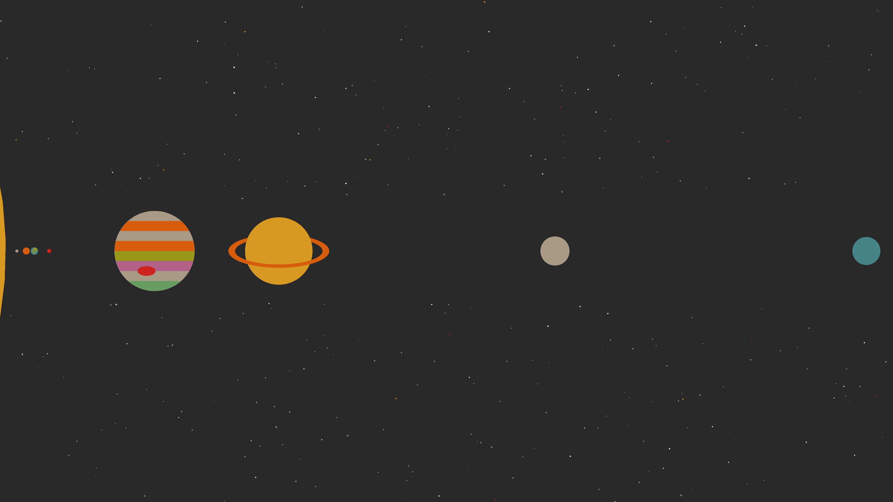
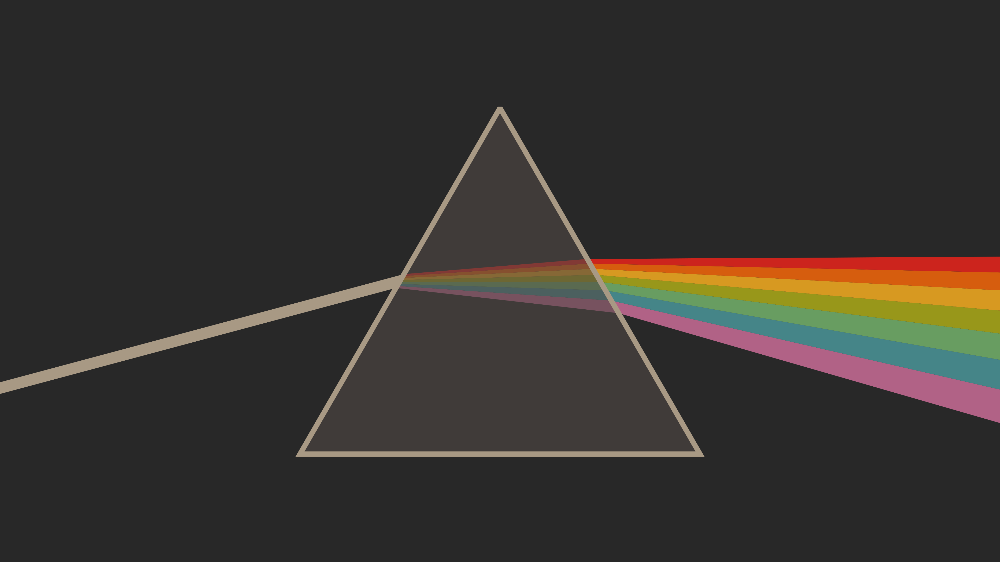
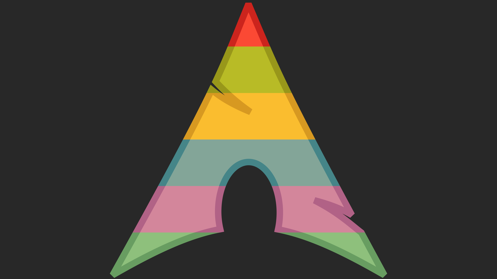
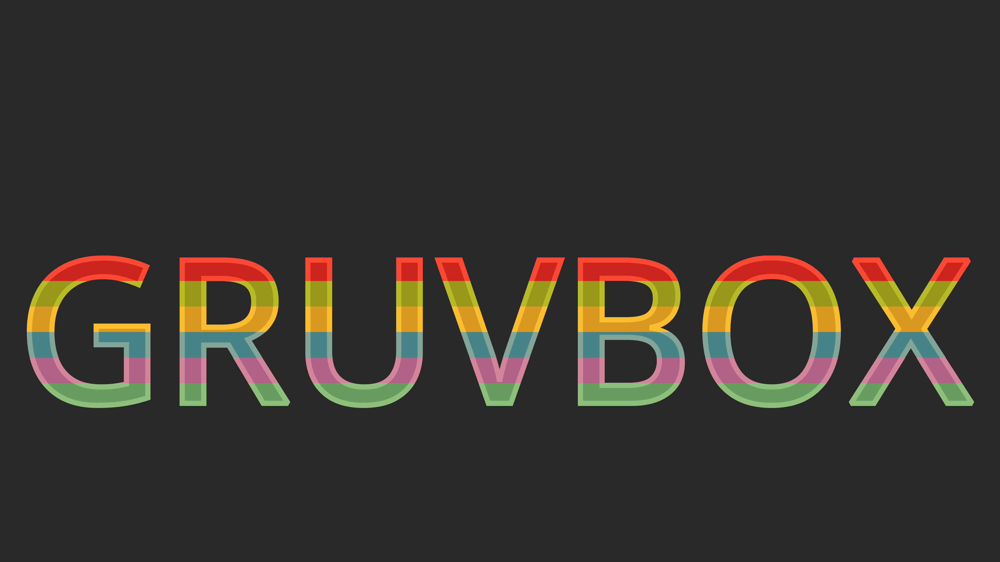

# Gruvbox Backgrounds

Generating simple backgrounds using `Makie.jl` (`CairoMakie`) and the Gruvbox colour-scheme: [`morhetz/gruvbox`](https://github.com/morhetz/gruvbox)

## Simple Solar System

Planets and distances are to Earth scale. Distance and planet size not to scale relative to each other. Distance in AU is assumed to be from the outer edge of Sol.

## Deflection of Light by a Triangular Prism

Note that the mathematics here are incorrect - the final refraction using Cauchy's Transmission Equation & Snell's Law is not applied correctly. The values for `A` and `B` are arbitrary and selected by trial and error to get a nice result.

## Splitting of Images/Text

Performed by utilisation of multiple axes with axes-limits set as though there was a single axis. Text adds additional axes above and below the text.

Positioning of text requires trial and error.

